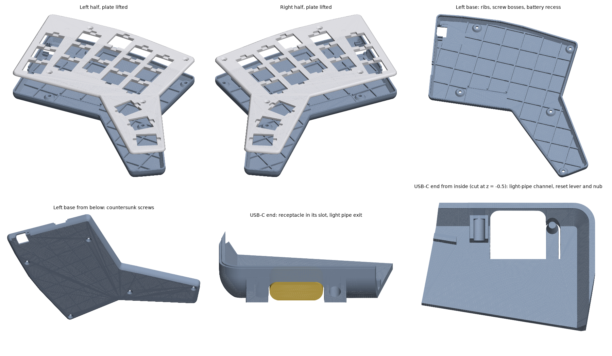

# Fortemis ZMK Config

ZMK config for the Fortemis keyboard (Forager+Totem+FerrisSweep)

## Hardware design

Fortemis is designed from scratch with [Ergogen](https://docs.ergogen.xyz), KiCad and a
Forager-style enclosed case. None has been built yet, so nothing has been tried on hardware.

- [docs/requirements.md](docs/requirements.md): goals and requirements
- [docs/design-log.md](docs/design-log.md): design decisions and progress
- [docs/build-guide.md](docs/build-guide.md): parts list and how to build one
- `ergogen/`: the Ergogen layout config, footprints and build tools
- `pcb/`: KiCad 10 projects for both halves (routed); `pcb/fab/`: Gerber zips to order, and BOM and
  placement files for PCB assembly
- `case/`: STL files to print, a top plate and a base for each half

Rebuild the PCBs from `ergogen/config.yaml` (needs node, KiCad 10 and Java 25+):

```sh
python3 ergogen/tools/pcb.py build   # Ergogen -> pcb/*.kicad_pcb
python3 ergogen/tools/pcb.py route   # Freerouting + GND pours, then DRC
python3 ergogen/tools/pcb.py drc     # DRC summary only
python3 ergogen/tools/pcb.py fab     # Gerbers + drill -> pcb/fab/*.zip, BOM + placement CSVs
```

Rebuild the case from the PCBs (needs KiCad 10 and `pip install -r ergogen/tools/requirements.txt`):

```sh
python3 ergogen/tools/case.py        # case/*.stl and docs/img/case.png
```



## Firmware

This repository is also the keyboard's [ZMK](https://zmk.dev) module and config, on ZMK v0.3.0.

- `boards/shields/fortemis/`: the shield: pins, keymap and the key layout ZMK Studio draws
- `build.yaml`: the firmware images to build; `config/west.yml`: ZMK and module versions
- [zmk-rgbled-widget](https://github.com/caksoylar/zmk-rgbled-widget) shows battery and connection
  status on the XIAO's RGB LED, which the case's light pipe carries to the USB-C end
- [ZMK Studio](https://zmk.dev/docs/features/studio) works with the left half (or the dongle),
  over USB or Bluetooth. Unlock it with the maintenance layer's U (below).

The keymap (`boards/shields/fortemis/fortemis.keymap`) is the owner's Forager keymap: QWERTY with
home-row mods and four layers. The near and far thumbs keep the Forager thumbs' keys, and the new
tuck thumbs are Esc (tap) / media layer (hold) on the left and Delete on the right.

Holding both near thumbs (Enter + Backspace) gives the maintenance layer:

| Key | Does |
|---|---|
| Q or P, held 2 s | Reboots that half into its bootloader |
| T, held 2 s | Reboots the central (the left half, or the dongle in dongle mode) into its bootloader |
| A S D F G | Bluetooth profiles 0 to 4 |
| W | Clears the current Bluetooth profile |
| U | Unlocks ZMK Studio |

### Building

Push to GitHub: the *Build ZMK firmware* action builds every image, and the run's `firmware`
artifact holds the `.uf2` files. Or build them locally with Docker:

```sh
ergogen/tools/zmk_build.sh   # every image in build.yaml -> firmware/*.uf2
```

The pin lists and Studio's key layout in the shield are generated from the PCBs, so re-run this
after changing a PCB (needs KiCad 10 and `pip install -r ergogen/tools/requirements.txt`):

```sh
python3 ergogen/tools/zmk.py           # update the shield from pcb/*.kicad_pcb
python3 ergogen/tools/zmk.py --check   # only check; fails if the shield and the PCBs differ
```

### Flashing

1. Plug the half into a computer and double-press its reset button. On an assembled half, press the
   lever in the case floor, near the USB-C port, twice. The XIAO shows up as a USB drive (usually
   named `XIAO-SENSE`).
2. Copy the half's `.uf2` file onto the drive. The half restarts with the new firmware.

| File | Flash to | Mode |
|---|---|---|
| `fortemis_left rgbled_adapter-seeeduino_xiao_ble-zmk.uf2` | left half | standalone |
| `fortemis_right rgbled_adapter-seeeduino_xiao_ble-zmk.uf2` | right half | **both** (the right half is a peripheral either way) |
| `fortemis_left_dongle_mode.uf2` | left half | dongle |
| `fortemis_dongle.uf2` | dongle | dongle |
| `settings_reset-seeeduino_xiao_ble-zmk.uf2` | either half | clears the half's Bluetooth pairings |
| `settings_reset_dongle.uf2` | dongle | clears the dongle's Bluetooth pairings |

In standalone mode the left half is the central: pair the computer with **Fortemis**. If the halves
don't connect to each other, flash the settings reset to both, then the firmware again.

The first time a half runs the firmware, it restarts once by itself. Two of the XIAO Plus's pads
(D14 and D15) are the chip's NFC antenna pins, and the firmware turns NFC off so that they work as
key inputs. That setting is stored in the chip, so it survives later flashing.

### Dongle mode (PandaKB USB dongle)

The keyboard can also run through
[PandaKB's ZMK dongle](https://pandakb.com/shop/keyboard-kit/pandakb-zmk-split-keyboard-dongle/)
(a nice!nano v2 with a 1.3" OLED), as the Forager does. The dongle becomes the central and both
halves its peripherals: plug it into a computer and the keyboard works as a USB keyboard, with no
Bluetooth pairing on that computer. ZMK fixes each part's role at build time, so switching modes
means reflashing.

- **Setup:** turn off other ZMK keyboards nearby, flash the settings reset to the dongle and both
  halves (the standalone pairings must be cleared first), then flash the dongle-mode firmware, plug
  in the dongle and turn both halves on. To go back, reset the halves and flash the standalone left
  firmware.
- Keymap changes then only need the dongle reflashed. To reach its bootloader without opening its
  case, use the maintenance layer's T.
- The dongle keeps all five Bluetooth profiles, so it can also pair to computers on its own battery,
  and ZMK Studio works with it. It never deep-sleeps: only a key press wakes a ZMK device, and the
  dongle has no keys.
