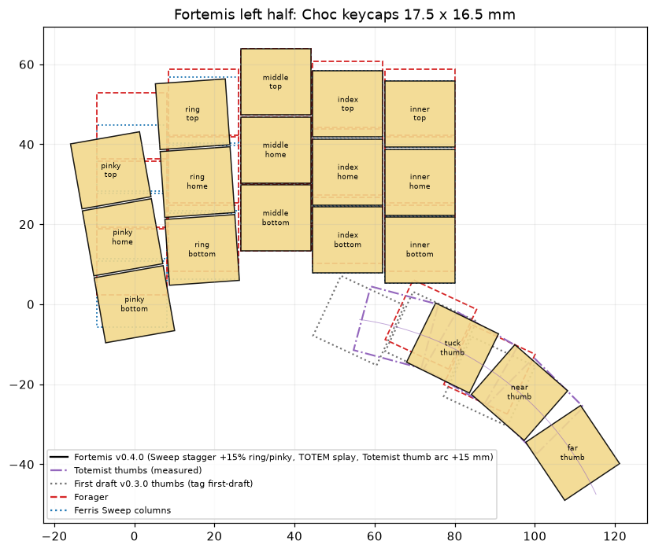
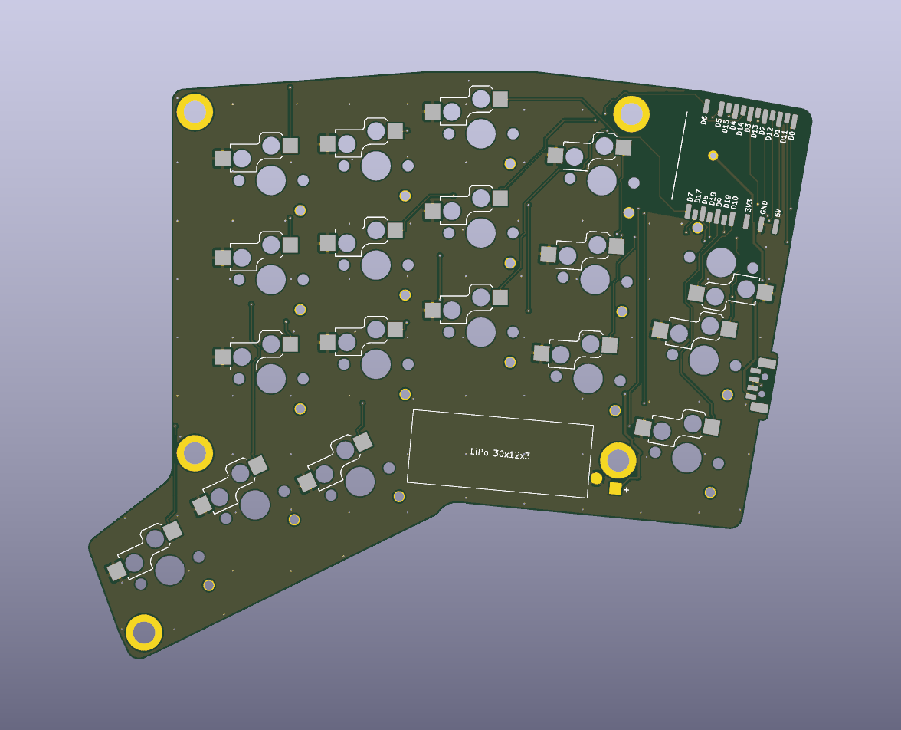
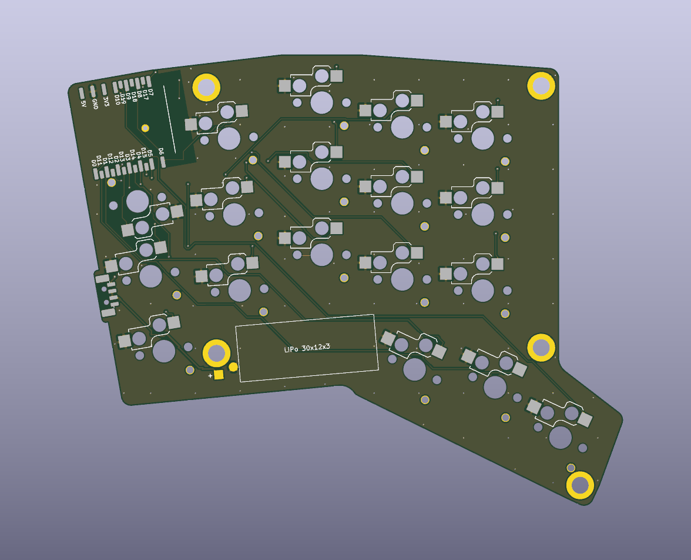

# Fortemis design log

This is a running record of how Fortemis is being designed: research, decisions and their reasons,
and progress. Newest entries are at the bottom. Requirement IDs (L1, E4, C1, …) refer to
[requirements.md](requirements.md).

## Status

| Area | State |
|---|---|
| Requirements | Written ([requirements.md](requirements.md)) |
| Reference geometry (Sweep, TOTEM, Forager) | Extracted and checked |
| Controller and diode decision | Decided: XIAO nRF52840 **Plus**, no diodes (D4) |
| Power switch part | Chosen: MSK12C02 (TOTEM's part) on a PCB tab through the base wall (D6) |
| Ergogen layout (`ergogen/config.yaml`) | Done (v0.3.0): 36 keys, board outline, controller, power-switch tab, screw nuts and battery placed |
| PCB routing, DRC, fabrication files | Done: both halves routed, KiCad DRC 0 errors / 0 warnings / 0 unconnected. Gerbers, and BOM and placement files for JLCPCB assembly, in `pcb/fab/` |
| Case STLs | Done: `case/` has a top plate and a base for each half, checked against models of the components (`ergogen/tools/case.py`) |
| ZMK firmware | Done: shield and config in this repository (ZMK v0.3.0), standalone and PandaKB dongle modes, ZMK Studio. All six images build and every key traces to the right PCB switch; not yet tried on hardware. |
| Build guide and parts list | Done: [build-guide.md](build-guide.md), with links for every part |

---

## 2026-10-08: Tool selection (T1)

- The tool in Ben Vallack's video ["Design Your Own Keyboard!"](https://www.youtube.com/watch?v=M_VuXVErD6E)
  is **[Ergogen](https://docs.ergogen.xyz)**. It is free and open source. You describe the keyboard
  in one YAML file (columns, stagger, splay, thumb keys), and it generates:
  - key positions
  - outlines, as DXF/SVG for the PCB edge and the case
  - a KiCad PCB with the footprints already placed
- There are two browser front-ends that read the same YAML: the original
  [ergogen.cache.works](https://ergogen.cache.works) and the newer
  [ergogen.ceoloide.com](https://ergogen.ceoloide.com), which has more footprints.
- This repo uses the command-line version, pinned to 4.2.1 (`npx ergogen@4.2.1`), so every output can
  be rebuilt from the config. The same `config.yaml` can be pasted into either web UI to see or tweak
  it.
- Footprints come from [ceoloide/ergogen-footprints](https://github.com/ceoloide/ergogen-footprints),
  copied into `ergogen/footprints/ceoloide/`. Each file keeps its own license header. Most are MIT;
  some derived files are CC-BY-NC-SA-4.0, which is fine for a personal build.
- Ergogen only places parts. Wiring (traces) is done afterwards with
  [Freerouting](https://github.com/freerouting/freerouting) and KiCad 10. The design-rule check and
  Gerber export run through `kicad-cli`.

## 2026-10-08: Reference geometry

All three source boards publish their hardware files, except Totemist. Positions were read directly
from their KiCad PCBs (and the Forager's STEP case). Ergogen rebuilds of TOTEM and Forager reproduce
every key to within 0.001 mm.

| | Ferris Sweep (Bling LP) | TOTEM 0.3 | Forager rev 2 |
|---|---|---|---|
| License | Solderpad 2.1 | CERN-OHL-P v2 | CERN-OHL-P v2 |
| Keys | 34 | 38 | 34 |
| Spacing | 18 × 17 (Choc) | 18 × 17 | 18 × 17 |
| Stagger vs middle column (mm, + = toward you): pinky / ring / index / inner | 19 / 7 / 5.5 / 8 | ≈25.6 / 10.2 / 8.4 / 11.2 | 11 / 5 / 3 / 5 |
| Splay (column angle): inner / index / middle / ring / pinky | none | **0 / 0 / 0 / 4° / 10°** | none |
| Thumbs | 2, 15° / 30° | 3, 0° / 15° / 30° | **2, both 25°, 18 mm apart, outer one 4 mm lower** |
| Controller | nice!nano, socketed on top | XIAO nRF52840, flat on top | **XIAO nRF52840 face-down on the underside, above the pinky column** |
| Diodes | none (one pin per key) | 38 | 34 (4 × 5 matrix) |
| Power switch | small SMD slide switch | MSK12C02 SMD slide switch | **none** (relies on ZMK sleep) |
| Reset | B3U button | SKHLLCA010 button | **XIAO's own button, pressed by a print-in-place lever in the bottom case** |
| Case | none (plateless) | top and bottom plates, open sides | **enclosed 2-piece, 117 × 99 × 8.4 mm per half** |

Forager case details that Fortemis copies:

- **Top plate:** 2.2 mm thick and rests on the PCB. It has 13.9 mm switch cutouts, and a 1 mm
  chamfer underneath leaves a 1.2 mm ledge for the switch clips. Puller grooves are 4.4 × 2.55 ×
  1.5 mm.
- **Base:** 6.2 mm tall, made of a 1 mm floor, a 3.6 mm cavity under the PCB, and walls 1 mm thick
  with 0.3 mm clearance to the PCB.
- **Screws:** 5 SMD M2 nuts on the PCB, with 4 countersunk screws from the top and 5 from the bottom
  per half.
- **Other features:** an LED light pipe made from a 6 mm piece of 1.75 mm clear filament, a USB-C
  opening, and magnetic tenting legs (about 16.5°).

## 2026-10-08: Decisions

**D1, stagger (L1, L1b).** The base stagger is the Sweep's. Ring and pinky are made 15 % steeper,
in the middle of the 10–20 % range asked for:

- ring: 7 → **8.0 mm** below the middle column
- pinky: 12 → **13.8 mm** below the ring column, so **21.8 mm** below the middle column
- index and inner index stay at the Sweep's 5.5 and 8 mm

The owner counts columns from the inner side, so the 4th and 5th columns are ring and pinky (see
requirements §6.1). The extra steepness is one setting in the config.

**D2, splay (L2).** Fortemis uses TOTEM's exact column angles: ring 4°, pinky 10°, the rest 0°.
Each angled column pivots at the bottom corner it shares with its inner neighbour, as on TOTEM:

- The columns fan apart toward the top, so the gap between them grows from the bottom row up.
- At the pivot the keycaps just touch.
- The pivot must sit at or below the bottom edge of the bottom key, or neighbouring keycaps
  collide.

**D3, thumbs (L3, L4).** The thumb keys are placed relative to the inner index column's bottom key,
exactly as on the Forager:

- Thumb 1 is +2.75 mm across and 21.6 mm down from that key, rotated 25°.
- Thumb 2 is 18 mm further along and 4 mm lower, in the same rotated frame.

The inner column is 3 mm lower than on the Forager (Sweep stagger), and the thumbs move down with
it, so the gap between the thumbs and the main keys stays the same. Whether to add a 3rd thumb key
will be decided once the outline is drawn: only if the board barely grows.

**D4, controller and diodes (E1, E4; C1 has priority).** Fortemis uses the **Seeed XIAO nRF52840
Plus**, wired without diodes (one pin per key).

| Option | Free pins | Diodeless? | Fits the Forager case? |
|---|---|---|---|
| XIAO nRF52840 (the ones already owned) | 11 edge + 2 NFC pads = 13 | ❌ needs 17 pins; a diode matrix is required (Forager's approach) | ✅ |
| nice!nano v2 | 21 | ✅ 34 keys | ⚠️ 33 × 18 mm (12 mm longer than a XIAO); through-hole pins, not castellations; single-colour LED and no reset button on the board, so the Forager's RGB light pipe and reset lever lose their target |
| **XIAO nRF52840 Plus** | **19** (20 pads; D16 is wired to the battery-voltage sense, so it's left out) | ✅ up to 36 keys | ✅ Same 21 × 17.8 mm size as the regular XIAO, with the same flat, face-down soldering. It has the RGB LED and reset button the case relies on. |

- The Plus keeps the regular XIAO's 14 castellated edge pads in the same places. It adds 9 more
  castellations between them, 1.27 mm from the originals.
- All the extra pins solder from the board edge with an iron, like the originals, so nothing has to
  be soldered underneath. This was checked against Seeed's published KiCad files for the Plus.
- So the diodeless wish (E4) is met without the nice!nano trade-off, and the Forager case is
  unchanged (C1).
- The cost: two new XIAO Plus boards (Seeed part 6359). The regular XIAOs already owned can't drive
  a diodeless Fortemis.
- If the owner would rather use the boards they already have, the alternative is the Forager's
  route: regular XIAO plus 34 or 36 diodes. That means changing the config and re-routing the PCB.
  The case stays the same.

**D5, switches (E3, E3b, L5).**

- **Spacing:** 18 × 17 mm Choc spacing. Choc keycaps (17.5 × 16.5 mm) fit; MX keycaps don't.
- **PCB footprint:** ceoloide's `switch_choc_v1_v2`. Its Kailh Choc hot-swap socket (CPG135001S30)
  fits both Choc v1 and v2, and it has holes for both switch types.
- **Top plate:** printed in two versions, one for each switch type:
  - v1: 13.9 mm cutouts, as on the Forager
  - v2: 14.0 mm cutouts
- One Fortemis PCB therefore takes either switch type, and only the top plate changes.

**D6, power and reset (E5, C1).**

- **Reset:** the Forager's print-in-place lever, pressing the XIAO's own reset button, is kept.
  This is the reset tab the owner likes.
- **Power:** the Forager has no power switch, so one is added to each half: a side-actuated slide
  switch whose lever sticks out through the case wall far enough to flip with a finger. This avoids
  the Sweep's problem, where the switch has to be reached with a toothpick through the USB opening.
  Part selection is next.

## 2026-10-08: Layout v0 (`ergogen/config.yaml`, points only)



The layout is generated by Ergogen 4.2.1 and checked with `ergogen/tools/check_layout.py`:

| Check | Result |
|---|---|
| Column angles, inner → pinky | 0 / 0 / 0 / 4 / 10° (TOTEM) ✅ |
| Home-key drop below the middle column: inner / index / ring / pinky | 8.0 / 5.5 / **8.0** / **21.8** mm. Sweep is 8 / 5.5 / 7 / 19, so ring and pinky are +15 % ✅ |
| Thumb 1 relative to the inner bottom key | 2.749 mm across, 21.6 mm down, rotated 25°, same as Forager ✅ |
| Thumb 2 relative to the inner bottom key | 17.37 mm across, 32.83 mm down, same as Forager ✅ |
| Closest pair of Choc keycaps | 0.5 mm apart (normal 18 × 17 gap); no overlaps ✅ |

**Refinement to D1: how stagger is measured once columns are angled.**

- Ergogen applies stagger along each column's own tilted axis. Rotating a column about its bottom
  corner also lowers it slightly.
- With the plain numbers (8.0 and 13.8 mm along the axis), the pinky home key ended up 24.8 mm below
  the middle home key. That is 31 % steeper than the Sweep, more than requested.
- The requirement is read as "the home keys sit where the Sweep's do, plus the bonus, and are then
  angled". So `check_layout.py --solve` adjusts the along-axis values (ring 7.317 mm, pinky
  11.436 mm) until the home keys land exactly 8.0 and 21.8 mm below the middle home key.
- Want a different steepness? Change `TARGET` in `check_layout.py` and re-run `--solve`. For example,
  set ring 7 and pinky 19 for the Sweep's exact values.

**Thumbs:** the Fortemis inner column is 3 mm lower than the Forager's, so the whole thumb cluster
sits 3 mm lower relative to the middle finger. Its distance and angle to the nearest keys (inner and
index columns) are identical to the Forager's.

## 2026-10-08: Power switch part (D6 update)

**Part: Shou Han MSK12C02**, the switch TOTEM uses (LCSC C431540). Requirement E5 says TOTEM-sized
switches are fine.

The Sweep's switch (Korean Hroparts K3-1296S-E1) is the same size as TOTEM's: 6.6 × 2.7 mm body, same
pads. So size wasn't the Sweep's problem; access was. Its case hid the switch behind the wall, so it
needed a toothpick. Fortemis fixes access, not size:

- The switch is soldered under the PCB, at the edge, with its lever pointing out through the side
  of the case.
- The PCB has a small tab, about 9 mm wide, under the switch. The tab reaches through a notch in
  the base wall to the outside of the case. So the switch's face sits just inside the case surface,
  not behind a 1.3 mm wall and gap.
- The lever then sticks out about 1.1 mm past the case wall. That's like TOTEM, where the switch
  sits at the open edge of the board, and can be flipped with a fingertip or nail.
- The switch's face is 0.35 mm behind the tab edge, to keep its copper pads 0.3 mm from the board
  edge, which the PCB maker requires.
- The notch is open at the top, so the PCB drops into the base as before. The top plate closes it.
- The switch is 1.5 mm tall and fits easily in the 3.6 mm space under the PCB.

| Part | Body (mm) | Lever | Fits the Fortemis footprint? |
|---|---|---|---|
| **Shou Han MSK12C02** (TOTEM) | 6.7 × 2.8 × 1.5 | 1.45 mm | ✅ main part |
| Korean Hroparts K3-1296S-E1 (Sweep) | 6.6 × 2.7 | similar | ✅ same pads, so a switch salvaged from the Sweep works |
| C&K PCM12SMTR (DigiKey, Mouser) | 6.7 × 2.6 × 1.5 | 1.55 mm | ✅ the footprint's pads are stretched to cover its slightly different pad positions |
| C&K JS102011SAQN | 9 × 3.6 × **3.5** | 2.0 mm | ❌ too tall for the 3.6 mm space under the PCB |
| Alps SSSS811101 (ceoloide's footprint) | smaller | shorter | ❌ smaller than TOTEM's, and that footprint is non-commercial (CC-BY-NC-SA) |

Wiring:

- Battery + goes to the switch's middle pin. One outer pin goes to the XIAO's BAT+ pad.
- As on any keyboard with a power switch, the battery only charges over USB while the switch is
  ON.

Where exactly on the edge it goes (outer wall next to the USB-C opening, or the top wall near the
USB end of the XIAO) is decided with the outline. Either way it stays away from the XIAO's antenna
end.

## 2026-10-08: Bonus 3rd thumb key (D7)

Requirement L4 allows a 3rd thumb key per half only if it doesn't enlarge the footprint or add PCB
requirements. Three spots were tested against a Forager-style outline: the keys' convex hull with
a 2.25 mm margin, the thumb cluster as a lobe, and rounded corners.

| 3rd key position (in the thumbs' 25° frame) | Result |
|---|---|
| 18 mm inward of the near thumb, level with it | ❌ overlaps the index column's bottom key |
| **18 mm inward of the near thumb, 4 mm lower** (mirror of how the far thumb sits) | ✅ 0.5 mm from every neighbouring keycap (normal Choc gap). Same bounding box. Board area **+3.3 %**, because it fills the notch the Forager outline has between the main keys and the thumbs. |
| 18 mm outward of the far thumb, 4 mm lower | ❌ board grows 15 mm wider and 11 mm taller |

**Decision: add it, as the "tuck" thumb.** The board's overall size (its bounding box, which is the
desk footprint) does not change. The extra area only fills the notch, which makes the bottom edge
one straight line from the pinky to the far thumb. Electrically, 18 keys per half uses 18 of the
XIAO Plus's 19 free pins, with no diodes, so no new PCB requirement.

- Thumbs, from the inside out: **tuck · near · far**.
- Near and far are unchanged: they still sit exactly where the Forager's thumbs do.
- The owner's keymap uses two thumbs per half, so the tuck key is a spare. It can hold a layer, a
  modifier, or nothing.
- To go back to 34 keys, delete the `tuck` column and its two-step anchor in `ergogen/config.yaml`.
  This has to happen before the PCB is ordered.


## 2026-10-08: Board outline and part placement (layout v0.3.0)

The outline follows the Forager's recipe: a hull around the keys (18 × 17 mm each), the controller
and the screw nuts, 2.25 mm outside them, with the thumb keys as a second hull merged in. Outside
corners are rounded to r2.25 and inside corners to r3.75. Each PCB is 124.4 × 101.0 mm including the
power-switch tab (the Forager's is 114.6 × 96.3 mm).

| Part | Placement | Why |
|---|---|---|
| XIAO nRF52840 Plus | Face down on the back above the pinky column, like the Forager's, but 4.8 mm higher | Its pads clear the pinky top switch's Choc v2 centre hole and corner leg |
| | USB-C end 0.25 mm inside the PCB edge | Same as the Forager |
| | 0.5 mm of extra board along both rows of pads (`xiao_margin`) | The pads stick out 1.5 mm past the module, so they would end only 0.75 mm from the edge. That fits one trace inside the 0.3 mm copper-to-edge limit, with no slack for the router. Now 1.25 mm. |
| Pinky top switch | Hot-swap socket turned 180° | Keeps the socket out from under the XIAO (as on the Forager) |
| Power switch | On a 12 × 3.35 mm tab in the outer (pinky-side) wall, below the USB-C opening and 2.5 mm below the pinky home key's centre. The tab ends flush with the case's outer surface. | 2.5 mm lower clears the pinky home key's socket on the right half, where the sockets are not mirrored |
| 5 M2 SMD nuts | Same spots as the Forager's, relative to the nearest keys, except two (below) | |
| | Bottom-left nut, right of the pinky bottom key: as far up and left as the top plate allows (1.3 mm between its countersink and the key cutout) | Makes room for the battery |
| | Thumb nut: 1.25 mm further out and 1.05 mm lower | Clears the far thumb's Choc v2 corner leg on the right half |
| 301230 LiPo (30 × 12 × 3 mm) | On the case floor under the lower halves of the ring and middle bottom keys (the Forager's is under its middle and index bottom keys). A 31 × 12.5 mm area is kept free for it. | Placed by a search that keeps it at least 0.95 mm from every switch post, hot-swap socket and screw boss on both halves |
| Battery wires | Soldered to two pads next to the cell; no JST connector | As on the Forager, where the connector is optional |

## 2026-10-08: Footprints

Switches use ceoloide's `switch_choc_v1_v2`: Kailh Choc v1 or v2 switches in Kailh hot-swap
sockets on the back. That footprint is CC-BY-NC-SA-4.0 (non-commercial). That's fine for a personal
build, but selling boards would need a different switch footprint.

Four footprints were written for Fortemis, in `ergogen/footprints/fortemis/` (MIT):

| Footprint | Notes |
|---|---|
| `mcu_xiao_nrf52840_plus` | The XIAO Plus, soldered flat and face down on the back, the Forager's way. Pad positions come from Seeed's KiCad files for the Plus: 14 castellations at the regular XIAO positions plus 9 between them, 1.27 mm apart. The pads stick out 1.5 mm past the module, so each castellation can be soldered with an iron from the side. |
| | D16 gets no pad: on the Plus it is wired to the battery-voltage divider. |
| | The module's BAT+ pad is on its underside, so the PCB has a plated hole under it, soldered from the front. BAT− isn't needed: it is the same net as the GND castellation. |
| | No copper pour from the antenna end to 4.5 mm past it (as on the Forager), and no tracks or vias right behind it. No vias under the module's bare underside pads; the other vias under it are tented. |
| | Pin names on the back silkscreen, to check orientation before soldering (the module covers them). |
| | On the right half the module is turned 180°, not mirrored, so it is still face down and its USB-C end still points out of the board. |
| `power_switch_msk12c02_side` | The MSK12C02 under the tab, lever pointing out. Also fits the K3-1296S-E1 (Sweep) and C&K PCM12SMTR. These switches have uneven pin spacing (3.0 then 1.5 mm), and a part on the back is seen mirrored from the front. So the middle (common) pin gets a pad at both possible positions: the switch works either way round, and only the lever's ON direction changes. |
| `nut_smd_m2` | M2 SMD nut (SMTSO2020MTJ), same land as the Forager's: 3.8 mm plated hole, 6.2 mm pad |
| `battery_lipo_pads` | Two wire pads (+ is square and marked) and the battery's area on the back silkscreen |

## 2026-10-08: Pin map

No diodes (D5): each switch goes from its own XIAO pin to GND, so 18 keys use 18 of the Plus's 19
usable pins. The halves use different pins because the right module is turned 180°, not mirrored,
which swaps which row of pads faces the keys. In each half, the keys nearest the module use pads on
the row facing them.

| Key (bottom / home / top) | Left | Right |
|---|---|---|
| Pinky | D9 / D19 / D10 | D14 / D3 / D13 |
| Ring | D18 / D8 / D17 | D4 / D5 / D6 |
| Middle | D5 / D6 / D7 | D8 / D17 / D7 |
| Index | D3 / D14 / D4 | D19 / D9 / **D15** |
| Inner | D12 / D2 / D13 | D12 / D2 / D10 |
| Thumbs (tuck / near / far) | D1 / D11 / D0 | D1 / D11 / D0 |
| Spare | D15 | D18 |
| No pad | D16 (battery voltage) | D16 |

The right index top key was going to use D18. That pad is in the row along the board's top edge,
boxed in by D8 and D9, and the router could not get a trace out of it (see below), so D15 is used.

Power: battery + goes to the power switch's common pin, the switched pin to the XIAO's BAT+, and
battery − to GND.

## 2026-10-08: PCB routing (`ergogen/tools/pcb.py`)

Both halves are routed by script, so a layout change only needs a re-run:

```sh
python3 ergogen/tools/pcb.py build   # Ergogen -> pcb/<half>.kicad_pcb with JLCPCB's 2-layer rules
python3 ergogen/tools/pcb.py route   # Freerouting + GND pours, then KiCad DRC
python3 ergogen/tools/pcb.py fab     # Gerbers + drill files -> pcb/fab/<half>.zip
```

- `route` exports each board from KiCad to Freerouting's format (Specctra DSN).
  [Freerouting](https://github.com/freerouting/freerouting) 2.5 routes every signal net, and KiCad
  imports the result.
- GND is not routed as tracks. `ergogen/tools/pcb_kicad.py` pours it on both copper layers
  afterwards. All GND pads are on the back, so stitching vias connect the front pour: on a 10 mm
  grid wherever both pours overlap, plus one in each front island the grid misses.
- Rules (JLCPCB's standard 2-layer process): 0.2 mm clearance; 0.2 mm tracks, 0.4 mm for the
  battery, which Freerouting narrows to 0.15 mm (battery 0.3 mm) in places, the minimum the rules
  allow; 0.6 / 0.3 mm vias; 0.3 mm from copper to the board edge.

| | Left | Right |
|---|---|---|
| Signal vias | 44 | 31 |
| GND stitching vias | 93 | 97 |
| Track length | 1423 mm | 1314 mm |
| KiCad DRC | 0 errors, 0 warnings, 0 unconnected | 0 errors, 0 warnings, 0 unconnected |
| Copper in the antenna keepout | none | none |





*The back of each PCB (KiCad render). Seen from below, the left half looks mirrored. The XIAO's pads
are in the top corner, the switch tab is on the outer edge and the battery outline is under the
bottom row.*

Problems found along the way, and their fixes:

| Problem | Fix |
|---|---|
| Freerouting 2.1.0 wrote its result from an earlier board state, so routed wires were missing after the import | Freerouting 2.5.0 (needs Java 25 or newer) |
| KiCad exports every rule area as a full keepout, so the antenna's "no copper pour" area also blocked tracks | That area is left out of the export. It only matters for the pour, which KiCad does itself. |
| Freerouting rounds coordinates, so a track could end up a few µm closer than 0.2 mm, which KiCad's DRC rejects | Clearances in the export are 10 µm larger than the real rule |
| Freerouting's board-edge clearance made pads near the edge unreachable | The edge rule is replaced by 0.1 mm keepout strips just inside the edge (0.1 mm + 0.21 mm clearance ≥ the 0.3 mm rule) |
| With several threads, Freerouting gives a different result each run, and one run left 0.1 mm track stubs that failed DRC | One thread (`-mt 1`): the same result every run, about 20 s per half |
| Right half: no route out of the XIAO's D18 pad, even when routed on its own | The right index top key uses D15 instead (pin map above) |

## 2026-10-08: Fabrication files

`pcb.py fab` writes one zip per half: `pcb/fab/fortemis_left.zip` and `pcb/fab/fortemis_right.zip`.
Each holds the Gerbers (copper, solder mask, paste and silkscreen for both sides, board outline),
plated and non-plated drill files with drill maps, and a Gerber job file.

- 2 layers, 1.6 mm thick, the Forager case's PCB thickness.
- Vias are tented: solder mask covers them.
- The halves are mirror images, not one reversible board, so both zips are ordered.
- The KiCad projects are in `pcb/` and open in KiCad 10.

## 2026-10-08: Case (`ergogen/tools/case.py`)

`case.py` builds the four case parts from the routed PCBs:

```sh
python3 ergogen/tools/case.py   # case/<half>_top.stl, case/<half>_base.stl, docs/img/case.png
```

The script reads the board outline and the positions of the switches, nuts, XIAO, power switch and
battery from `pcb/<half>.kicad_pcb` (through KiCad's Python), so the case follows the PCB if it
changes. Solids are built with [manifold3d](https://github.com/elalish/manifold), whose booleans
always give watertight meshes. Before writing the STLs, the script checks each part against simple
models of the components: PCB, switch housings, hot-swap sockets and switch posts, nuts, the XIAO
with its USB-C, LEDs and reset button, the power switch, the battery and its wires. The script
fails if a part overlaps any of them or is not a single solid.


| | Forager | Fortemis |
|---|---|---|
| Size per half | 117.2 × 98.9 × 8.4 mm | 126.8 × 103.4 × 8.4 mm |
| Stack | base 6.2 mm (floor 1.0, 3.6 mm under the PCB, wall top flush with the PCB's top), top plate 2.2 mm | same |
| Plastic per half (plate + base) | 9.4 + 10.6 cm³ | 11.3 + 12.1 cm³, about 29 g of PLA if printed solid |

The features copy the Forager's, measured from its STEP and STL files:

| Feature | Like the Forager? | Notes |
|---|---|---|
| Outline: PCB edge + 1.3 mm, shared by plate and base | ✅ | The power switch's PCB tab is left out; it ends flush with the outer wall |
| Plate: 13.9 mm square switch cutouts, turned with each key | ✅ | Square corners like the Forager's, 0.05 mm clear of the 13.8 mm switch housing |
| Plate: 1 mm 45° chamfer under the east and west sides of each cutout, leaving a 1.2 mm ledge for the Choc clips | ✅ | |
| Plate: switch-puller grooves north and south of each cutout (4.4 mm wide, 2.55 mm long, 1.5 mm deep) | ✅ | |
| Edges: plate 0.35 mm chamfer below and r2.08 mm round on top; base r5.39 mm round at the bottom and a 0.4 mm reveal at the seam | ✅ | |
| Base: 1.0 mm wall, 0.3 mm around the PCB, inner wall sloping 2 mm inward toward the floor | ✅ | |
| Base: 1.2 mm tall floor ribs on a grid | ✅ | 1 mm wide on a 15 mm grid, kept 1 mm clear of the battery, XIAO and power switch |
| Screws: M2 countersunk into the 5 SMD nuts, 5 from below and 4 from above (none from above at the thumb nut) | ✅ | Top screws go wherever their countersink stays 0.8 mm from the cutouts and grooves. On both halves that's every nut except the thumb nut, as on the Forager. |
| Screw bosses: cones under the nuts, 0.1 mm below them | ✅ | |
| USB-C: outer wall flat for 8.4 mm either side of the port, a 9.44 mm slot open at the bottom, a floor opening under the XIAO's end | ✅ | The slot's top is at −0.95 mm instead of −1.05 mm, so the receptacle clears the wall even when the XIAO is soldered tight against the PCB |
| Reset: print-in-place lever in the floor (2 × 1 mm, 6.5 mm long, in a 0.4 mm slot) with a cone nub under the XIAO's reset button | ✅ | Placed from the XIAO's pads, so it is right on both halves |
| LED light pipe: 1.95 mm bore from the RGB LED out through the USB-C end, for a 6 mm piece of 1.75 mm clear filament | ✅ | |
| Battery: 0.4 mm recess in the floor | ✅ | Under the area kept free for the 301230 cell |
| Pocket in the plate's underside over the XIAO's BAT+ joint, which is soldered from the front | | 3 mm wide, 0.6 mm deep |
| Power switch: notch through the base wall for the PCB tab and the switch | ❌ new | The Forager has no power switch. The lever sticks out 1.15 mm past the wall. |
| Magnetic tenting legs (pockets and pin holes in the base) | ❌ left out | Not in the requirements; can be added later |

Closest gaps between the parts and the components, the same on both halves: switch housings
0.05 mm, USB-C receptacle 0.05 mm, XIAO 0.07 mm, nuts 0.1 mm (as on the Forager), switch posts
0.2 mm, power switch 0.3 mm. The battery rests on the floor of its recess. Nothing touches even if
the XIAO sits 0.15 mm lower on a thick layer of solder.

Building and printing:

- Print for FDM, as the Forager is designed for, in the orientation of the STLs: base floor down,
  plate top face up. The clip chamfers then print as 45° overhangs. The base's bottom round is
  steeper than 45° only in its lowest 0.6 mm.
- The reset lever is printed in place. As the Forager's guide warns, too much first-layer squish
  can fuse it to the floor, so adjust the z-offset if it is stuck.
- Screws: 18 × M2 countersunk, **4 mm** long. A top screw and a bottom screw meet in each nut, and
  two 4 mm screws leave 0.4 mm between their tips; 5 mm screws would collide.
- Fit the plate first, with a few switches at the corners to line it up, then fit the base USB-C
  end first so that the receptacle slides under the wall above the slot (the Forager's order).
- The plate is cut for Choc v1, like the Forager's. Choc v2 switches fit the PCB, but how they fit
  this plate is untested.

Problems found along the way, and their fixes:

| Problem | Fix |
|---|---|
| KiCad exports the outline's rounded corners as short straight segments, and the 1.3 mm offset adds tiny corners between them. Shrinking that outline by 2 mm for the sloping inner wall folded it over itself. | The outline's corners are rounded to the PCB's 2.25 mm radius plus the offset before it is shrunk |
| The first plate had 0.5 mm radii in the cutout corners, which would cut into the switch housing's square corners | Square corners, as measured on the Forager's plate |
| With the Forager's slot height, the USB-C receptacle's top, which is the XIAO's underside, overlapped the wall above the slot by 0.05 mm | Slot top raised by 0.1 mm |

## 2026-10-08: ZMK firmware

This repository is now also the keyboard's [ZMK](https://zmk.dev) module and config, set up like the
owner's Forager module, on ZMK v0.3.0. GitHub Actions builds the images listed in `build.yaml`, and
`ergogen/tools/zmk_build.sh` builds the same ones locally with ZMK's Docker image. The README
explains building and flashing.

| Image | Board | Role |
|---|---|---|
| `fortemis_left`, with ZMK Studio | XIAO nRF52840 | Central in standalone mode |
| `fortemis_right` | XIAO nRF52840 | Peripheral in both modes |
| `fortemis_left_dongle_mode` | XIAO nRF52840 | Peripheral of the dongle |
| `fortemis_dongle`, with ZMK Studio | nice!nano v2 (PandaKB dongle) | Central in dongle mode, with a status screen on its OLED |
| `settings_reset`, `settings_reset_dongle` | both | Clear Bluetooth pairings |

How the shield (`boards/shields/fortemis/`) works:

| Part | How | Why |
|---|---|---|
| Board | ZMK's `seeeduino_xiao_ble`, the regular XIAO nRF52840 | ZMK has no board for the Plus. The Plus has the same chip, LED, button, battery sensing and flash, and only adds pads. |
| Pins | Named by nRF52840 port and pin (`&gpio0 9`) rather than through the XIAO's `&xiao_d` pin header | That header only covers D0 to D10. The D-pin to nRF52840 pin table in `zmk.py` matches Seeed's pinout. |
| Key scanning | `zmk,kscan-gpio-direct`: each key's pin is pulled up and reads low when pressed | No diodes and no matrix (D5) |
| Key order | One row of 36 columns. Each half reports its 18 keys in keymap order, and the right half's `col-offset` moves its keys to 18–35. | |
| Pin lists, and the key layout ZMK Studio draws | Generated from the PCBs by `ergogen/tools/zmk.py`. `zmk.py --check` fails if they no longer match. | A PCB change can't quietly break the firmware |
| NFC pins | D14 and D15 are P0.09 and P0.10, the nRF52840's NFC antenna pins. The half overlays set `nfct-pins-as-gpios` on the chip's UICR node, so on its first boot the firmware stores that setting in the chip and restarts once. | ZMK v0.3.0's Zephyr (3.5) deprecated the older `CONFIG_NFCT_PINS_AS_GPIOS` option |
| UART | Off | D6 and D7, the XIAO's UART pins, carry keys |
| RGB LED | caksoylar's [zmk-rgbled-widget](https://github.com/caksoylar/zmk-rgbled-widget) v0.3.0 | Battery and connection status through the case's light pipe, as on the Forager |
| Deep sleep | Off, as on the owner's Forager | The power switch turns a half off. The key scan is already a wake-up source, so `CONFIG_ZMK_SLEEP=y` would work if it's wanted later. |
| Dongle mode | The Forager module's `pandakb_dongle` shield (OLED wiring) and its keyless central shield, renamed `fortemis_dongle`. englmaxi's [zmk-dongle-display](https://github.com/englmaxi/zmk-dongle-display) v0.3 draws the screen. | Same dongle as the owner's Forager |
| 2-second holds for the bootloader keys | The Forager module's `zmk,behavior-long-press` (`src/`, `dts/`) | |

The keymap is the owner's Forager keymap, moved onto 36 keys:

| Keys | Bindings |
|---|---|
| The 30 main keys | Unchanged |
| Near and far thumbs | Unchanged, because they sit where the Forager's two thumbs are. Left: Enter, Shift / Tab. Right: Space / NUM layer, Backspace. |
| Tuck thumbs (new) | Left: Esc on tap, MED (media) layer on hold. No key reached the MED layer on the Forager. Right: Delete. |
| Maintenance layer | Held by both near thumbs, the same two keys as the Forager's combo |
| ZMK Studio unlock (new) | U on the maintenance layer. ZMK keeps Studio locked until a `&studio_unlock` key is pressed, and the Forager keymap has none, so Studio could connect but not change anything. |

Checks:

| Check | Result |
|---|---|
| All six images build with ZMK's Docker image, the same build that GitHub Actions runs, including from an empty workspace | ✅ The only warnings come from ZMK, Zephyr's nRF52840 files and the dongle-display module |
| Settings in each image: keyboard name, central or peripheral role, ZMK Studio on the left half and the dongle, two peripherals on the dongle | ✅ |
| Each of the 36 keys, followed through the compiled firmware from its pin to its keymap position and ABC-layer key, against the switch the PCB wires to that pin | ✅ All 36 right, no pin used twice |
| ZMK Studio's key layout against the switch centres on the PCBs | ✅ Within 0.18 mm (rounding) |
| NFC pins | ✅ The startup code that frees them is compiled into all three half images |
| On real hardware | Not yet: no boards have been built |

Problems found along the way, and their fixes:

| Problem | Fix |
|---|---|
| The ZMK config template's `.gitignore` ignored `zephyr/`, which would have left out `zephyr/module.yml`, the file that makes this repository a ZMK module | Line removed |
| `CONFIG_NFCT_PINS_AS_GPIOS` builds with a deprecation warning on ZMK v0.3.0 | The devicetree setting instead |
| The Forager keymap's `label` properties are deprecated in ZMK v0.3.0 | Removed |
| ZMK Studio stays locked without a `&studio_unlock` key | Added to the maintenance layer |

## 2026-10-08: Assembly files and build guide

[build-guide.md](build-guide.md) is the build guide and parts list. It follows the Forager's build
guide, since Fortemis is built the same way, and adds the power switch, the XIAO Plus's extra pads
and testing before the case is closed.

`pcb.py fab` now also writes the files for JLCPCB's PCB assembly service, next to each half's
Gerber zip. The XIAO and the battery are soldered by hand, so they're left out.

| File | Holds |
|---|---|
| `pcb/fab/<half>_bom.csv` | The parts JLCPCB can solder, with their LCSC numbers: 18 Choc hot-swap sockets (C5333465), 5 M2 SMD nuts (C2916384) and the power switch (C431540) per half |
| `pcb/fab/<half>_cpl.csv` | Where each part goes: position, angle and side. Every part is on the back. |

| Part | Placement from |
|---|---|
| Nuts and power switch | Their footprints, as in KiCad's own placement export (`kicad-cli pcb export pos`) |
| Hot-swap sockets | Each socket is part of its switch's footprint, which KiCad leaves out of placement files and BOMs because the switch isn't soldered. So `pcb.py` adds a line for each socket, centred between its two pads, at the switch's angle. |

JLCPCB's part models don't always share KiCad's zero angle, so the guide says to check every part
in JLCPCB's placement preview before ordering.

Checks:

| Check | Result |
|---|---|
| Parts per half | ✅ 24: 18 sockets, 5 nuts, 1 power switch |
| Nut and power switch positions and angles against `kicad-cli pcb export pos` | ✅ The same |
| Each socket's position against its two switch-pin holes, the holes its cups sit over | ✅ Halfway between them |
| Every link in the parts list | ✅ All open (2026-10-08) |

Where to buy, as of 2026-10-08:

| Part | Notes |
|---|---|
| XIAO nRF52840 Plus | Seeed Studio. The owner's regular XIAOs have too few pads (D4). |
| Choc hot-swap sockets | Out of stock at LCSC; Typeractive and lowprokb.ca sell them |
| M2 SMD nuts, MSK12C02 | In stock at LCSC |
| 301230 LiPo without a connector | Typeractive. The 401230 that the Forager also takes is 4 mm thick, which would fill the whole 4.0 mm between the PCB and the bottom of the floor's battery recess. |
| M2 × 4 mm countersunk screws, bumpers | The McMaster-Carr parts the Forager's guide links. The screws must be 4 mm, not 5 mm (see Case). |

The switch footprint, from ceoloide's library, is licensed CC BY-NC-SA 4.0, so the guide notes
that the PCBs are for personal, non-commercial builds.
